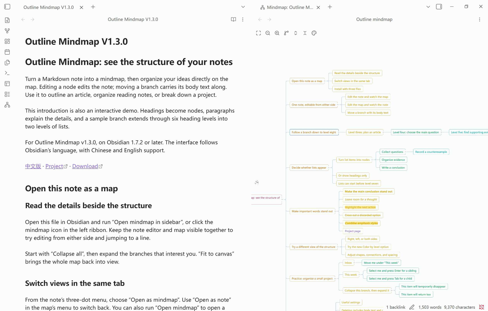
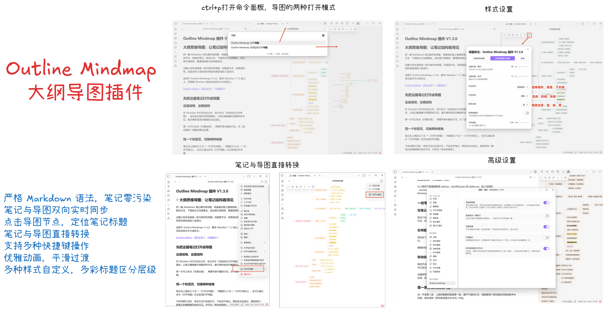

# Outline Mindmap

**English** · [中文](readme-zh.md) · [插件介绍（可在 Obsidian 里直接打开的演示笔记）](插件介绍.md)

Turn a Markdown note’s outline into a mindmap with live two-way editing, click-to-locate navigation and customizable styles. The note remains the source of truth; settings stay in the plugin’s `data.json`, without adding frontmatter, tags or hidden markers.



Demos were recorded with an earlier version; in 1.3.4, layout direction is in **Style settings**.



- **Obsidian** 1.7.2+ · desktop and mobile · **v1.3.4**
- The interface follows Obsidian's language: 中文 / English, no setting to touch.

## Features

- **Two-way editing**: Add, rename, delete and rearrange nodes. Body text moves with its heading; write-back replaces only the affected line range and preserves surrounding content and formatting.
- **Navigation**: Locate nodes in a visible note, including Reading view. Search results reveal and highlight matches; undo/redo also works in map-only mode.
- **Note ⇄ map**: Switch within the same tab and optionally remember how each note opens.
- **Flexible content**: Show headings by default or enable list nodes, with inline formatting, link labels and math.
- **Styles and layout**: Customize shapes, colors, fonts, spacing, edges and branch direction, with global/per-note settings, live preview and Cancel.
- **Convenient controls**: Keyboard shortcuts, smooth animation, per-note locking, zoom and position memory, and touch pinch/pan.

One map action is one undo. Open editors use native history; map-only views use bounded session history and refuse to overwrite external changes.

## Install

Not in the community plugin browser yet, so install manually:

1. Download `main.js`, `manifest.json` and `styles.css` from the
   [Releases](../../releases/latest) page — those three files are the whole plugin.
2. Put them in `<your vault>/.obsidian/plugins/outline-mindmap/`
3. Enable **Outline Mindmap** under *Settings → Community plugins*

`main.js` is a build artifact and is **not** committed here, so cloning the repository is not a
shortcut to installing — build it, or take the release.

Building from source:

```bash
npm ci
npm run build     # type-check + bundle into main.js
```

## Usage

Four ways to open the map:

- The mindmap icon in the left ribbon → opens in the **right sidebar**
- Command palette → *打开导图* (Open mindmap) → opens as a **tab in the main area**
- Command palette → *在侧边栏打开导图* (Open mindmap in the sidebar)
- A note's ⋯ menu → **打开为导图** (Open as mindmap): the current tab turns into a map in place
  (right-clicking a note in the file explorer offers the same item)

Use **Open as note** in the map’s menu to return within the same tab, restoring the previous Reading/Editing mode.

- **Independent main-area maps**: **Open mindmap** opens a separate, natively pinned tab for each note. Repeating the command for the same note reveals its existing map without resetting edits, selection, or the viewport. Running the command from a map uses that map’s note.
- **Following maps**: The ribbon and **Open mindmap in the sidebar** retain a shared sidebar map that follows the active note. Enable **Always show one note** to keep it on one file.
- Native tab pinning prevents another note from replacing the tab. It is separate from binding a map to its note: removing the native tab pin does not make an independent map follow other notes. **Open as mindmap** retains its existing in-place conversion behavior.
- **Per-note maps**: **Open as mindmap** converts the note’s tab in place and stays on that note. The opening form can be remembered; form changes do not enter tab history.

In map-only mode, a node click selects it without opening a note. To read prose alongside the map, use the sidebar or a split pane. Click-to-locate only scrolls a note that is already visible.

### How a note becomes a map

| In the note | Level in the map |
| --- | --- |
| `# Heading` … `###### Heading` | Levels 1–6 |
| `- list item` (one level = 4 spaces or one tab of indent) | Level 7 and deeper (can be turned off — see *Show list items as nodes*) |
| Body paragraphs under a heading | Not shown, but **move together with their heading** |
| A `#` inside a fenced code block | Not a heading, never appears in the map |

Inline markup in node text — `**bold**`, `*italic*`, `***bold italic***`, `==highlight==`,
`~~strikethrough~~` — is rendered as such and nests freely. An unpaired `*` (as in `2 * 3`) is
plain text and is never swallowed.

Inline math written as `$...$` is rendered by Obsidian's own MathJax engine. Math can sit next
to ordinary text and other inline markup; malformed expressions fall back to their editable
source instead of breaking the map. Display-math blocks (`$$...$$`) remain note body content.

Links show **only the readable part**, so paths and URLs cost no node width:

| In the note | Shown in the map |
| --- | --- |
| `[[Some note]]` | Some note |
| `[[folder/target\|alias]]` | alias |
| `[[note#section]]`, `[[#section]]` | section |
| `[text](https://…)` | text |

Link text is tinted with the theme's link colour but is **not clickable** — a click in the map
already means "jump to the matching line in the note", and competing for the same click would
only make it unpredictable.

### Keyboard

| Key | Action |
| --- | --- |
| `↑` `↓` | Previous / next node: siblings first, then out to the enclosing level |
| `→` (the "go in" direction) | Expand a collapsed branch, or enter its first child if already expanded |
| `←` (the "go back" direction) | Collapse an expanded branch, or go to the parent if already collapsed |
| `Enter` | Add a sibling after the current node |
| `Tab` | Add a child to the current node |
| `F2` / double-click a node | Rename |
| `Delete` / `Backspace` | Delete the selected node and its whole subtree |
| `Ctrl/⌘ + Z` | Undo (also works with only the map open) |
| `Ctrl/⌘ + Shift + Z` / `Ctrl + Y` | Redo |
| `Esc` | Abandon the current edit or drag — not a single character is written |
| Double-click empty space | Create a new free root node |
| `Ctrl/⌘ + click` | Add to / remove from the selection (for deleting a batch) |
| Drag a node | Reorder: drop on a node's top/bottom edge = insert before / after, drop in the middle = become its child, drop on empty space = become a new root |
| Wheel | Pan; hold `Ctrl/⌘` to zoom around the pointer |

Left and right on the arrow keys are interpreted **relative to the direction the node grows**:
when a branch runs leftwards, `←` is the key that takes you *into* its children.

### Toolbar

Fit to canvas · Zoom out · Zoom in · Expand all · Collapse all · Lock · Style settings.

Layout direction (branches right / left / both sides) is in **Style settings**, with the same
global and per-note saving, live preview and Cancel behavior as other styles.

The lock remembers your manual choice for each note. A locked map still follows changes made
in the note, and allows navigation, pan, zoom, fold/unfold and style changes. It cannot rename,
add, delete or rearrange nodes, or undo/redo changes. **Reading view forces the map to lock**;
returning to Editing view restores your manual choice. A visible Reading view of the same note
takes precedence if that note is open in several panes. Converting a Reading tab to a pure map
keeps its Reading mode; use *Open as note* to change the note's mode.

Each note remembers its **zoom and viewing position**, including after a restart. The saved
point stays centered when the viewport changes size. If changed content leaves that region
empty, the map shows a nearby node at the saved zoom. Folded state remains session-only,
so changed layouts are not guaranteed to put the same node in the same place.

On touch screens, use two fingers to zoom and pan. A second finger cancels an unfinished node
drag; finishing a gesture does not also click or edit a node. In a locked map, one finger can
pan from a node as well as empty space; tapping still selects or locates it.

*Branches on both sides* splits the root's branches into two balanced columns **by subtree size**.

## Settings

| Toggle | Default | What it does |
| --- | --- | --- |
| 单击即跳转 (Click to jump) | On | Clicking a node scrolls the visible note to the matching heading or list item and highlights it in both Editing and Reading view (focus stays on the map); after you create / rename / delete / drag a node, the note also stays at that node. **It only scrolls a note that is already visible on screen** — it never opens a tab, never splits a pane, never pulls a background tab to the front. Turn it off and a click only selects |
| 固定显示一篇笔记 (Always show one note) | Off | The map stops following the active note and stays on the one it was opened with |
| 优雅动画 (Smooth animation) | On | Nodes and edges move together. Disabled above 250 visible nodes or when the system requests reduced motion |
| 严格换行 (Strict blank lines) | Off | When enabled, adding / moving nodes pads adjacent headings to 3 blank lines apart |
| 把列表项显示为节点 (Show list items as nodes) | Off | Turn it off and the map shows headings only: list items go back to being body text under their heading. The note itself is not touched; switching back restores every list node. While it is off, adding or dragging past level 6 is blocked with a notice — a level-7 heading has no visible syntax to write |
| 记住每篇笔记的打开方式 (Remember how each note opens) | On | A note converted with **Open as mindmap** opens as a mindmap next time, in whichever tab it appears; **Open as note** restores it, in the Reading / Editing mode it had when converted. The record lives only in the plugin's `data.json` and is migrated or cleaned up when the note is renamed, moved or deleted. Switching form does not enter tab history, so *Back* / *Forward* move between notes only |

Styles — shape, colour scheme, **colour by level**, font size, horizontal and vertical gaps,
branch style (**straight / diagonal / elbow**) — come in two levels, **global** and **per-note**: a note with
no style of its own uses the global one. While the style window is open, dragging a slider
previews live, and *Cancel* restores. Per-note styles are keyed by file path and are migrated or
cleaned up automatically when you rename, move or delete a note.

## Performance

Pan and zoom update a single container transform; edges share one path and node events are delegated. Animation is disabled above 250 visible nodes or when reduced motion is requested.

The repository includes a [1000-node stress note](bench/1000节点压力测试笔记.md). Automated tests cover parsing, layout and editing; use **Performance self-check** in Obsidian to measure actual rendering, or **Follow self-check** to diagnose note-following issues.

## Known limitations

- Text-only maps: no summaries, no free-form connections, no images, no notes.
- Collapsed state is not persisted; switching notes resets it.
- Task list items `- [ ]` are treated as plain text; ordered lists are read fine but written
  back as `-`.
- Multi-select (`Ctrl/⌘ + click`) is for batch deletion only, not batch drag.

## Development

```bash
npm run dev        # watch build
npm run typecheck  # strict type-check
npm test           # unit + integration tests
```

`core/` and `layout/` contain pure logic without Obsidian imports; `doc/` handles document I/O and note-view integration, `view/` manages map interaction, and `settings/` owns settings, styles and preferences.

To install a dev build into a vault without copying three files by hand every round:

```bash
npm run deploy "D:\your vault"   # remembers the target in deploy.json (git-ignored)
npm run deploy                   # afterwards: build + install into the remembered vaults
```

It overwrites only `main.js`, `manifest.json` and `styles.css` — never `data.json`, never a note.
If the vault already has this plugin under a differently-named folder, it reuses that folder
rather than creating a second copy with the same plugin id.

Before publishing, run `npm test` and `npm run build`. Keep `manifest.json`,
`package.json`, `package-lock.json` and `versions.json` in sync, then attach
`main.js`, `manifest.json` and `styles.css` to the `1.3.4` GitHub release.
**The tag carries no `v` prefix** — Obsidian looks releases up by the bare version number.

## What's new

### v1.3.4

- **Map locking**: Remember manual locks per note; Reading view forces locking. Locked maps prevent editing while still showing live note changes.
- **Layout settings**: Move branch direction into Style settings, with global/per-note saving, live preview and Cancel.
- **Viewport memory**: Restore each note’s zoom and position; show a nearby node if the saved region is empty.
- **Touch improvements**: Add pinch zoom and two-finger pan, reduce drag conflicts and accidental clicks, and enlarge toolbar/fold touch targets.

### v1.3.3

- Add map-only undo/redo and search-result navigation/highlighting; refine level colors and node/edge animation.
- Update default styles and options while preserving existing settings and per-note styles.

### v1.3.2

- Remember how each note opens, distinguish following and pinned maps, and fix stale content after switching notes.
- Improve in-place conversion and tab history without opening duplicate tabs.

### v1.3.1

- Improve click-to-locate in Reading view and add inline math rendering.

### v1.3.0

- Add Chinese/English UI, optional list nodes and level colors.

See [Releases](../../releases) for earlier versions.

## License

MIT — see [LICENSE](LICENSE).
